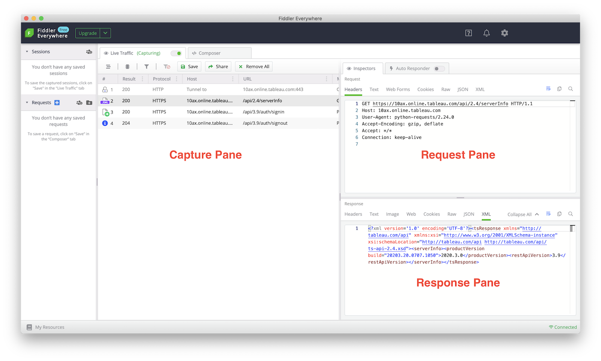

This page covers some common troubleshooting tips for using the TSC library.

<div class="alert alert-warning">
<span class="glyphicon glyphicon-warning-sign" aria-hidden="true"></span> Warning: Do not post any debug logs or REST API request/response contents anywhere on GitHub. The contents may include sensitive data or authentication secrets. Instead you can post just edited snippets of relevant content after sanitizing (removing any sensitive values).
</div>

* TOC
{:toc}

## Logging REST API communication with Tableau Server

There may be cases where it's helpful to inspect the REST API calls the TSC library is making and the responses coming back from Tableau Server. Some examples might be:

* The TSC library is throwing an error or the results are not coming through as expected
* The TSC library or the REST backend may have a bug which needs to be tracked down

To enable logging, add the following to your Python script ahead of making any TSC calls:

```py
import logging
logging.basicConfig(format='%(asctime)s - %(name)s - %(levelname)s - %(message)s',
                    filename="tsc.log", level="DEBUG")
```

Now when your script executes, you'll see a set of debug messages in the `tsc.log` file. Each API call to the REST API will be included along with the XML responses. Depending on the problem being investigated, you can compare these requests/responses to the [REST API documentation](https://help.tableau.com/current/api/rest_api/en-us/REST/rest_api.htm) to track down the issue.

## Capture REST API communication with local proxy

Another approach for inspecting REST API traffic is to use a local debugging proxy server like [Fiddler Everywhere](https://www.telerik.com/fiddler). Fiddler Everywhere is free for basic use and has versions for Mac, Windows and Linux.

These are the steps to send the API traffic through to a local proxy like Fiddler:

1. Install Fiddler Everywhere and create a free account if needed
2. Launch the Fiddler app and click the settings (gear) icon to enable Capture HTTPS traffic. (Do not click Trust root certificate.)
3. Before running your script, set the following environment variables (on Windows, use SET commands instead):
```shell
export HTTP_PROXY=http://127.0.0.1:8866
export HTTPS_PROXY=http://127.0.0.1:8866
export CURL_CA_BUNDLE=""
export PYTHONWARNINGS="ignore:Unverified HTTPS request"
```
4. Run your script
5. Check Fiddler Everywhere for the results

The sample screenshot below shows the results of running a simple sign in/out sequence. The Capture pane includes one row for each HTTP request. Select the request to see the details on the right side: Request and Response.



Proxy server applications other than Fiddler can be used as well. Just adjust the HTTP_PROXY and HTTPS_PROXY environment variables to use the proper IP address and port number.
